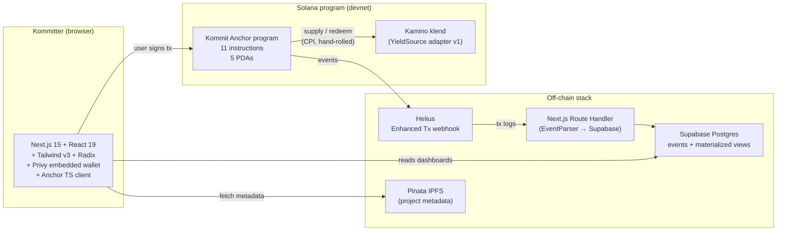

# Kommit

> *A conviction primitive — and a discovery primitive — on Solana.*
> *Real backers, real teams, real long-term alignment. None of it extractive.*

Kommit lets backers commit real money to early-stage teams without losing custody of that money. The mechanism: park USDC, allocate it across teams, withdraw your principal anytime. Yield on parked capital funds the platform — no fees on backers, no fees on teams. What accrues is **kommits**: capital × time committed, soulbound, public, on-chain. When teams raise, kommitters earn first-dibs rights to invest at round price.

It's also a discovery primitive. Teams put themselves out early, gain trust, and prove they can deliver — without burning early believers when the idea changes. Pivots happen *pre-capital-allocation*. No capital burn. Long-term alignment over quick burns.

Built for the [Solana Frontier hackathon](https://solana.com/frontier) (May 2026). MIT-licensed, open-source from commit 1.

> ⚠️ **Devnet-grade — not production-ready.** This codebase ships v0.5 to Solana Frontier and runs on **Solana devnet only**. It has **not been independently audited**. Mainnet deploy artifacts exist (`scripts/deploy_mainnet.sh`) but mainnet is gated on third-party audit and Squads multisig migration of admin + program upgrade authority — see [Deploy](#deploy). Do not commit funds you cannot afford to lose.
>
> See [`SECURITY.md`](SECURITY.md) for disclosure path and known limitations, [`SECURITY_REVIEW.md`](SECURITY_REVIEW.md) for the internal Anchor program review, and [`RECOVERY.md`](RECOVERY.md) for program-upgrade-keypair recovery.

**Live demo:** [kommit.now](https://kommit.now) (devnet) · **Manifesto:** [kommit.now/manifesto](https://kommit.now/manifesto) · **Pitch deck:** [kommit.now/pitch](https://kommit.now/pitch)

---

## What it does

The category Kommit invents: **a stake-backed signal layer for early-stage teams that converts to allocation rights at graduation.** Real money, real opportunity cost, real signal — without principal extraction.

Existing "early supporter" mechanisms fail at one of two things:

- **Signal without stake** — Product Hunt upvotes, Twitter likes, follower counts. Gameable, no opportunity cost.
- **Stake without survival** — equity crowdfunding (Wefunder, Republic, Crowdcube). Real money, but principal loss for backers; high friction.

Kommit's signal is **stake-backed and survival-compatible**. Real money committed for real time, with real opportunity cost (the yield you'd have earned by parking that money anywhere else). Hard to game: wash-trading volume doesn't work when the input is patient capital tied up over time. Easy to verify: public, soulbound, on-chain.

Three groups, all aligned because the project succeeding is good for all of them for their own reasons:

- **Founders** — get real PMF signal: patient capital, not upvotes. Demand validation cleaner than upvotes, faster than waiting for revenue. Onboard without paying fees or diluting equity.
- **Backers ("kommitters")** — park money, allocate across teams, keep custody. Earn a verifiable record of conviction that converts to first-dibs rights when the team raises.
- **Investors** — read a sybil-resistant demand signal for their next-round decisions. Patient capital pre-validates demand at retail scale.

---

## Sample flow

```
Park $100 on Kommit, allocate it to project X.
  → Kommits accrue continuously (capital × time) while the principal stays committed.
  → If the team raises through a kommit-compatible path, your earned standing converts
    to first-dibs allocation at round price.
  → Withdraw anytime — principal returns; kommit record stays as a portable
    public conviction signal.
```

Architecture detail (CPI to klend, escrow PDAs, two-path withdraw, score fields) lives in [`SECURITY_REVIEW.md`](SECURITY_REVIEW.md) and the program source under [`programs/kommit/src`](programs/kommit/src).

---

## Architecture



**On-chain / off-chain split:**

| Feature | Where | Why |
|---|---|---|
| Money escrow + redemption | On-chain | Asset itself; trust-critical |
| Yield routing (CPI) | On-chain | Programmable, composable, verifiable |
| Kommits accrual (capital × time) | On-chain | Verifiability is the whole thesis |
| Project metadata | Hybrid | IPFS pin + on-chain `metadata_uri_hash` |
| Project updates / posts | Off-chain | Postgres |
| Curation (which projects appear) | Off-chain | Centralized admin in v1; less-centralized paths in v2 |
| Indexing / dashboards | Off-chain | Helius webhook → Supabase materialized views |

---

## Status

**v0.5 — primitive feature-complete on devnet.** End-to-end klend round-trip verified; security review cleared (see [Security](#security)); 30/30 anchor TS tests + 8/8 Rust unit tests + 3/3 webhook fixture tests passing. Fiat rails (card / SEPA / bank) are the v1 architectural milestone — see scope section below.

**Frontend is wired live on devnet.** Real Privy auth (passkey + Google + email), real Anchor program reads, real on-chain commit/withdraw against the deployed program. Indexer reads through Supabase. A card-deposit flow (mock-card UX → sandbox-SPL airdrop) ships in v0.5 as the in-product demonstration of the v1 fiat-rails shape.

**Verified end-to-end on devnet** (full klend round-trip from merge commit [`7fd0965`](https://github.com/lamentierschweinchen/kommit/commit/7fd0965)):

| Step | Tx |
|---|---|
| `create_project` | [`LMRdECdG2WR2kK4...3as3`](https://solscan.io/tx/LMRdECdG2WR2kK4NQoA9Hn4ZDubxJSp7Zo4Sv6YCmBbHyCFkFh9ZB5FnrToTNyx449zKgMyzuffmtkcrYx33as3?cluster=devnet) |
| `commit` (0.1 USDC) | [`4eVns1cRvi5k3SAb...wPaK`](https://solscan.io/tx/4eVns1cRvi5k3SAbSDRqD3mQiN7DZRZDFFjdf2oKiWZwxPa8xuX8iNjjS6QPGz5ipsr3kckk5Yt26Pc6LFotwPaK?cluster=devnet) |
| `supply_to_yield_source` | [`3W3NLShGu4LdCN7n...NSED`](https://solscan.io/tx/3W3NLShGu4LdCN7nM7RfG4rhx9twwJnua9E3G7szwy6xznLMsWk5ZJnp3xtnLrdaMBkz5M8ri9MSvvv5Q3CfNSED?cluster=devnet) |
| `harvest` | [`MtMMPBZSwwNWtNMo...mxXAu`](https://solscan.io/tx/MtMMPBZSwwNWtNMovFwu5QRvfKX3JZPQ5KUj8p3GJd55FtnS5myoUxYS55BdiHBhS6rfvEe4NSqBFYFJwbmxXAu?cluster=devnet) |

**Devnet program ID:** `GxM3sxMp4FyrkHK4g1DaDrmwYLrwd2BJKxqKZqvGgkc3` (same address reserved for eventual mainnet).

---

## Repo layout

```
app/
├── programs/kommit/             # Anchor program (Rust, Anchor 0.31.1)
│   └── src/
│       ├── lib.rs               # Program entry point (11 instructions)
│       ├── state.rs             # 5 PDAs (KommitConfig, Project, Commitment,
│       │                        #   LendingPosition, KaminoAdapterConfig)
│       ├── errors.rs
│       ├── events.rs            # 7 events
│       ├── adapters/kamino.rs   # Hand-rolled klend CPI + ReserveSnapshot math
│       └── instructions/        # One file per instruction
├── tests/                       # 30 Anchor TS integration tests + 8 Rust unit tests
├── scripts/                     # Deploy + smoke + IPFS pin + create_project utilities
├── migrations/
│   └── supabase/                # Indexer schema + sandbox-airdrops + card-deposit
├── web/                         # Next.js 15 + React 19 frontend (App Router)
│   └── src/
│       ├── app/                 # Routes: /, /app, /projects, /projects/[slug],
│       │                        #   /dashboard, /account, /account/history,
│       │                        #   /founder/[slug], /founder/[slug]/cohort,
│       │                        #   /profile/[slug], /build, /about, /demo,
│       │                        #   /manifesto, /status
│       ├── public/pitch.html    # Pitch deck (standalone HTML, served at /pitch)
│       ├── components/          # Brutalist primitives + auth + commit/withdraw + dashboard
│       ├── lib/
│       │   ├── kommit.ts        # PDA derivation + program ID constants
│       │   ├── anchor-client.ts # Privy → Anchor wallet adapter, useKommitProgram hook
│       │   ├── tx.ts            # commit / withdraw transaction builders
│       │   ├── queries.ts       # Read-side facade (on-chain + indexer + demo)
│       │   ├── anchor-errors.ts # User-safe RPC/Anchor error mapping
│       │   ├── money.ts         # Decimal-safe bigint helpers (parseTokenAmount)
│       │   ├── kommit-math.ts   # Capital × time = kommits
│       │   ├── sandbox-*.ts     # Sandbox SPL mint, fee-payer, rate-limit, RPC helpers
│       │   └── idl/             # Bundled IDL JSON + TS types
│       └── app/api/webhook/helius/route.ts  # Indexer
├── sdk/reader/                  # @kommitapp/reader — public, free, permissionless SDK
│                                #   for any product to read kommit balances
├── idls/kamino_lending.json     # Reference: converted klend mainnet IDL
├── Anchor.toml
├── Cargo.toml
├── SECURITY.md                  # Disclosure policy + scope + severity rubric
├── SECURITY_REVIEW.md           # 14-item internal Anchor self-audit
├── RECOVERY.md                  # Program upgrade authority keypair recovery procedure
└── SETUP.md                     # First-time install + env var template
```

---

## Develop

See [`SETUP.md`](SETUP.md) for first-time install. Then:

```bash
# Anchor program
anchor build
anchor test                      # 30 TS tests + 8 Rust unit tests on a local validator

# Web app
cd web
cp .env.example .env.local       # fill in Privy / Helius / Supabase / Pinata keys
npm install
npm run dev                      # http://localhost:3000
```

Required env vars are documented in [`web/.env.example`](web/.env.example) and [`.env.example`](.env.example). The web app falls back to mock data when keys aren't set, so design review and click-through walks work without provisioning external services.

`NEXT_PUBLIC_KOMMIT_DEMO=1` in `.env.local` activates a populated three-persona demo mode (Lukas / Dr. Julian Vance / Sara Chen) with seeded portfolios, projects, comments, and reactions. This is the surface used for the persona-walkthrough at `/demo`. Production has the flag off — `/demo` shows the onchain-Privy entry as the primary path with the persona walkthrough as a secondary option.

---

## Deploy

**Devnet** is the v0.5 target for hackathon submission. The program is already deployed at `GxM3sxMp4FyrkHK4g1DaDrmwYLrwd2BJKxqKZqvGgkc3`.

**Mainnet artifacts** under [`scripts/`](scripts/) exist and are tested but not yet executed in production:

- [`scripts/deploy_mainnet.sh`](scripts/deploy_mainnet.sh) — preflight + idempotent `anchor deploy` + IDL init/upgrade. Supports `CLUSTER=devnet` for dry-runs.
- [`scripts/bootstrap_mainnet.ts`](scripts/bootstrap_mainnet.ts) — idempotent `initialize_config` call.
- [`scripts/smoke_mainnet.ts`](scripts/smoke_mainnet.ts) — small commit→accrue→withdraw round-trip once a seed project is created.
- [`scripts/smoke_klend_devnet.ts`](scripts/smoke_klend_devnet.ts) — devnet round-trip with the live klend USDC market.

Mainnet is gated on independent third-party audit + Squads multisig migration of admin + program upgrade authority.

---

## v0.5 / v1 / v2 scope

**v0.5 (this submission, devnet — today):**
- 11 instructions: `initialize_config`, `create_project`, `commit`, `withdraw`, `accrue_points`, `supply_to_yield_source`, `harvest`, `admin_pause`, `admin_unpause`, `admin_update_project_metadata`, `initialize_kamino_adapter_config`
- One yield-source adapter (Kamino klend USDC reserve)
- Single-sig admin + single-sig program upgrade authority (project lead's keypair)
- USDC entry, Solana wallet entry — Solana-fluent users only at this layer
- Walletless onboarding via Privy (passkey + email + Google)
- Sandbox-SPL airdrop + card-deposit flow on `/demo` so judges and evaluators can walk the flow without external funding
- Off-chain stack: Helius → Supabase indexer; Pinata for IPFS; Privy for embedded-wallet auth
- Frontend surfaces: landing (`/`), functional landing (`/app`), browse (`/projects`), project detail (`/projects/[slug]`), kommitter dashboard (`/dashboard`), history (`/account/history`), profile (`/profile/[slug]`), founder dashboard (`/founder/[slug]` + `/cohort`), account (`/account`), founder application (`/build`), about (`/about`), demo entry (`/demo`), manifesto (`/manifesto`), pitch deck (`/pitch`)
- `@kommitapp/reader` SDK on npm (MIT, v0.1.0) — public, free, permissionless reads of kommit balances

**v1 (post-submission, ~1-2 weeks — fiat rails, retail-frictionless):**
- **Card → USDC on Solana** via Privy's built-in [MoonPay](https://www.moonpay.com/business/onramp) and [Coinbase Pay](https://www.coinbase.com/onramp) — both first-class config flips in `@privy-io/react-auth`. ~5-min onboarding. The user enters their card, kommits; USDC under the hood.
- **SEPA → USDC** for EU users via [Helio](https://hel.io) or [Mercuryo](https://mercuryo.io) — Solana-native SDKs.
- **Off-ramps** via the same partner network (card-back / SEPA-back depending on entry rail).
- Squads V4 multisig governance for `KommitConfig.admin` + program upgrade authority (zero program-side change; vault PDA signs via `invoke_signed`)
- Squads smart-account project recipient wallets (sub-30s stand-up via `multisigCreateV2`)
- Second yield-source adapter (marginfi or Jupiter Lend)
- `admin_update_project_recipient` instruction for recipient rotation
- Founder application admin queue (currently invite-only)
- Earned-allocation-rights flow at graduation (kommitters with `lifetime_score` ≥ threshold get first dibs at the team's next round)
- Public-named display opt-in for kommitters
- Cross-chain commit via LI.FI bridge integration

**v2 (with Visa partnership — invisible-tech retail rails):**
- User enters their Visa card and a kommit amount in their local currency. Crypto vocabulary disappears entirely from the user surface — *the tech is invisible*. The technical rail under the hood: **Visa's USDC settlement on Solana** ($7B+ annualized run-rate per [CoinDesk April 2026](https://www.coindesk.com/business/2026/04/29/visa-expands-stablecoin-settlement-network-as-volume-hits-usd7-billion-run-rate)). Visa moves money in fiat; settlement clears in USDC on Solana inside Kommit's program. The user sees their card statement.
- Visa publishes a USDC-on-Solana settlement rail; v2 targets it. Partnership is how we get there — absent partnership, this is roadmap targeting an existing rail rather than something invented for the deck.
- Engineering: a partnership conversation, not a sprint. Architectural commitment locked now; ship date follows the partnership.

**v2+ (post-traction):**
- `create_graduation_attestation` PDAs + graduation flow
- Composable points-reading API consumer integrations (other Solana protocols gating access on `lifetime_score`)
- Cohort intelligence — aggregated, anonymized, opt-in cohort signal sold to launchpads / VCs / capital allocators, on top of the free public reads anyone can build with via `@kommitapp/reader`
- Less-centralized curation (DAO / multisig / staked-reputation)
- Mainnet — gated on third-party audit + Squads multisig in place + the v1 fiat-rails layer being live

**How the platform sustains itself (none on backers or founders):**
1. Yield on parked capital funds operations today.
2. Success fees on rounds Kommit helps close (v1+).
3. Cohort intelligence for launchpads + capital allocators (v2+) — premium analytics on top of the public open-source reads.

**Hard locks (never reopened):**
- No platform token. Ever.
- No fees on kommitters or founders.
- Kommitter principal stays redeemable, withdraw anytime, no cooldown.
- Soulbound on-chain reputation (kommits) — non-transferable by construction.

---

## Security

- [`SECURITY.md`](SECURITY.md) — disclosure email, in/out-of-scope, severity rubric.
- [`SECURITY_REVIEW.md`](SECURITY_REVIEW.md) — internal 14-item Anchor security checklist with file:line citations and named test verifications.
- [`RISK.md`](RISK.md) — structural risk surfaces named explicitly (smart-contract, yield-source, oracle, counterparty, regulatory, operational). Companion to SECURITY.md; covers tradeoffs we won't fix because they're not bugs, just things kommitters and reviewers should understand.
- [`RECOVERY.md`](RECOVERY.md) — program upgrade authority keypair recovery procedure (no secrets in the doc).

Review history:

- **Initial security review** — multiple findings raised and resolved before submission. Full audit trail in [`SECURITY_REVIEW.md`](SECURITY_REVIEW.md).
- **Verification pass** — clean. C1 fee-field math now matches `klend-sdk`'s `getTotalSupply()` semantics; harvest principal-preservation, signer-mismatch, and event-identity tests added.
- **Full-stack hardening pass** — multi-pass adversarial review across full-stack surfaces (auth, payments, on-chain, indexer); completed prior to submission.

Mainnet prerequisites called out explicitly: multisig admin + multisig upgrade authority + independent third-party audit. None of these are in place at v0.5; mainnet does not happen without all three.

---

## License

MIT — see [`LICENSE`](LICENSE). The `@kommitapp/reader` SDK ships under MIT on npm; any product can integrate without permission. The cohort is the moat, not lock-in.
