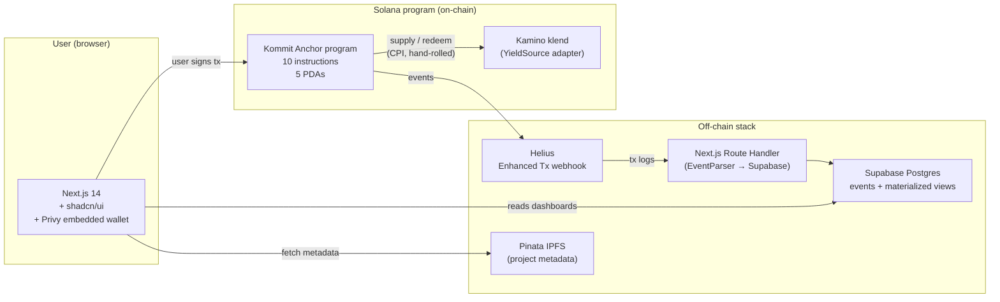

# Kommit

A Solana primitive for early-stage validation. Users park USDC; principal stays theirs in escrow; yield routes to a curated project's wallet; users earn soulbound on-chain reputation (capital × time, active + lifetime split). The platform issues no token, ever.

Built for the Solana Frontier hackathon (May 2026). MIT-licensed and open-source from commit 1.

## What it does

Equity crowdfunding (Crowdcube, Wefunder, Republic, Mirror Crowdfund) loses backers their principal at well-documented rates. Kommit inverts the model:

- **Backers** commit USDC to a curated early-stage project. Principal stays theirs in a per-project escrow PDA — withdraw anytime, no fees, no friction.
- **Yield** auto-routes to the project's wallet via a CPI to a Solana lending market (Kamino's klend in v1; yield-source-agnostic by design).
- **Reputation** accrues on-chain as soulbound `active_score` + `lifetime_score` — capital × time committed. Composable across the Solana stack; non-transferable; not a token.
- **Platform** issues no token, ever. Real revenue from a curated commitment fee (off-chain). No speculation loop.

### Sample flow ($100 USDC, 5% APY)

```
Backer commits 100 USDC to project X.
  → 100 USDC in per-project escrow PDA (still backer's)
  → CPI deposit to klend's USDC reserve
  → 100 cTokens minted to per-project collateral PDA
  → Backer accrues 100 USDC × seconds_elapsed of points (u128, on-chain)

Each week (~$0.10 of yield at 5% APY on $100):
  → Off-chain crank calls harvest(collateral_amount, min_yield)
  → Klend redeems cTokens at the current exchange rate
  → ~$0.10 USDC routed to project X's recipient wallet
  → ProjectX's cumulative_yield_routed bumps by $0.10
  → Backer's principal untouched

Backer withdraws anytime:
  → Layer-1 path (escrow has enough): direct transfer escrow → backer
  → Layer-2 path (escrow insufficient): klend redeem first, then transfer
  → 100 USDC back to backer's wallet
  → active_score zeroed; lifetime_score preserved
```

## Architecture



**On-chain / off-chain split** (more in [`../build_order.md`](../build_order.md)):

| Feature | Where | Why |
|---|---|---|
| Principal escrow | On-chain | Asset itself; trust-critical |
| Yield routing (CPI) | On-chain | Programmable, composable, verifiable |
| Points accrual (capital × time) | On-chain | Verifiability is the whole thesis |
| Project metadata | Hybrid | IPFS pin + on-chain hash |
| Project updates / posts | Off-chain | Postgres |
| Curation | Off-chain | Centralized admin in v1 |
| Indexing | Off-chain | Helius webhook → Supabase |

## Verified end-to-end on devnet (2026-05-04)

Full klend round-trip on devnet, $0.10 USDC committed and routed to a recipient wallet. Tx hashes from the merge commit body of [`7fd0965`](https://github.com/lamentierschweinchen/kommit/commit/7fd0965):

| Step | Tx |
|---|---|
| `create_project` | [`LMRdECdG2WR2kK4NQoA9Hn4ZDubxJSp7Zo4Sv6YCmBbHyCFkFh9ZB5FnrToTNyx449zKgMyzuffmtkcrYx33as3`](https://solscan.io/tx/LMRdECdG2WR2kK4NQoA9Hn4ZDubxJSp7Zo4Sv6YCmBbHyCFkFh9ZB5FnrToTNyx449zKgMyzuffmtkcrYx33as3?cluster=devnet) |
| `commit` (0.1 USDC) | [`4eVns1cRvi5k3SAbSDRqD3mQiN7DZRZDFFjdf2oKiWZwxPa8xuX8iNjjS6QPGz5ipsr3kckk5Yt26Pc6LFotwPaK`](https://solscan.io/tx/4eVns1cRvi5k3SAbSDRqD3mQiN7DZRZDFFjdf2oKiWZwxPa8xuX8iNjjS6QPGz5ipsr3kckk5Yt26Pc6LFotwPaK?cluster=devnet) |
| `supply_to_yield_source` | [`3W3NLShGu4LdCN7nM7RfG4rhx9twwJnua9E3G7szwy6xznLMsWk5ZJnp3xtnLrdaMBkz5M8ri9MSvvv5Q3CfNSED`](https://solscan.io/tx/3W3NLShGu4LdCN7nM7RfG4rhx9twwJnua9E3G7szwy6xznLMsWk5ZJnp3xtnLrdaMBkz5M8ri9MSvvv5Q3CfNSED?cluster=devnet) |
| `harvest` | [`MtMMPBZSwwNWtNMovFwu5QRvfKX3JZPQ5KUj8p3GJd55FtnS5myoUxYS55BdiHBhS6rfvEe4NSqBFYFJwbmxXAu`](https://solscan.io/tx/MtMMPBZSwwNWtNMovFwu5QRvfKX3JZPQ5KUj8p3GJd55FtnS5myoUxYS55BdiHBhS6rfvEe4NSqBFYFJwbmxXAu?cluster=devnet) |

Devnet program ID: `GxM3sxMp4FyrkHK4g1DaDrmwYLrwd2BJKxqKZqvGgkc3` (same as planned mainnet ID).

## Repo layout

```
app/
├── programs/kommit/             # Anchor program (Rust, Anchor 0.31.1)
│   └── src/
│       ├── lib.rs               # Program entry point (10 instructions)
│       ├── state.rs             # 5 PDAs + accrue helper
│       ├── errors.rs
│       ├── events.rs            # 7 events
│       ├── adapters/kamino.rs   # Hand-rolled klend CPI bindings
│       └── instructions/        # One file per instruction
├── tests/                       # 17 anchor-mocha integration tests
├── scripts/                     # Mainnet deploy + devnet smoke + IPFS pin + create_project
├── migrations/
│   └── supabase/                # Indexer schema migrations
├── web/                         # Next.js 14 frontend (TypeScript + Tailwind + shadcn/ui + Privy)
│   └── src/
│       ├── lib/kommit.ts        # PDA derivation + program client + Supabase clients
│       ├── lib/idl/             # Bundled IDL JSON + TS types
│       └── app/api/webhook/helius/route.ts  # Indexer
├── idls/kamino_lending.json     # Reference: converted klend mainnet IDL
├── Anchor.toml                  # [programs.localnet|devnet|mainnet] all set to the keypair-derived ID
├── Cargo.toml
├── SECURITY_REVIEW.md           # 14-item self-audit
└── SETUP.md                     # First-time install + mainnet deploy
```

## Develop

See [`SETUP.md`](SETUP.md) for first-time install. Then:

```bash
# Anchor program
anchor build
anchor test

# Web app
cd web && npm run dev
```

## Deploy

Mainnet deploy artifacts under [`scripts/`](scripts/) (gated on coordinator + frontend MVP demo-readiness; see SETUP.md section 9):

- [`scripts/deploy_mainnet.sh`](scripts/deploy_mainnet.sh) — preflight + idempotent `anchor deploy` + IDL init/upgrade. Supports `CLUSTER=devnet` for dry-runs.
- [`scripts/bootstrap_mainnet.ts`](scripts/bootstrap_mainnet.ts) — idempotent `initialize_config` call.
- [`scripts/smoke_mainnet.ts`](scripts/smoke_mainnet.ts) — `$10` USDC commit→accrue→withdraw on mainnet once a seed project is created.
- [`scripts/smoke_klend_devnet.ts`](scripts/smoke_klend_devnet.ts) — devnet round-trip with the live klend USDC market.

Required env vars in [`.env.example`](.env.example).

## v1 / v1.5 / v2 scope

**v1 (this hackathon submission):**
- 10 instructions: `initialize_config`, `create_project`, `commit`, `withdraw`, `accrue_points`, `supply_to_yield_source`, `harvest`, `admin_pause`, `admin_unpause`, `admin_update_project_metadata`
- One yield source (Kamino klend USDC reserve)
- Single-sig admin (Lukas's hardware wallet); single-sig program upgrade authority
- Whitelisted private beta on mainnet, 5–15 hand-curated projects, $1k self-commit
- Off-chain stack: Helius → Supabase indexer; Pinata for IPFS metadata; Privy embedded wallet
- Frontend: browse, project detail, user dashboard, founder dashboard

**v1.5 (post-launch, weeks-out):**
- Rotate program upgrade authority + `config.admin` to a Squads multisig (security review item 14.2/14.3)
- Second yield-source adapter (marginfi v2 pre-approved as the next slot)
- `admin_update_project_recipient` instruction (recipient wallet rotation)
- Founder application form (currently invite-only)
- Comments / community feedback
- Public-named display opt-in for committers

**v2 (post-traction):**
- `create_graduation_attestation` PDAs + graduation flow
- Composable points-reading API consumer integration (e.g. another Solana protocol gating access on `lifetime_score`)
- Optional Altitude payment rails (yield → ACH/SEPA/Wire)
- Less-centralized curation (DAO / multisig / staked-reputation)
- Native mobile

**Not in v1, never in v1** (locked decisions):
- No platform token. Ever.
- No on-chain comments / posts (stays off-chain — see [`../build_order.md`](../build_order.md))
- No on-chain curation (admin-curated in v1; v2 explores)

## Security

[`SECURITY_REVIEW.md`](SECURITY_REVIEW.md) — self-audit pass against a 14-item Anchor security checklist with file:line citations and named test verifications. Verdict: hackathon-private-beta-grade. Pre-scaling upgrade items (multisig admin + multisig upgrade authority + third-party audit) called out explicitly.

## License

MIT (see `LICENSE`).
